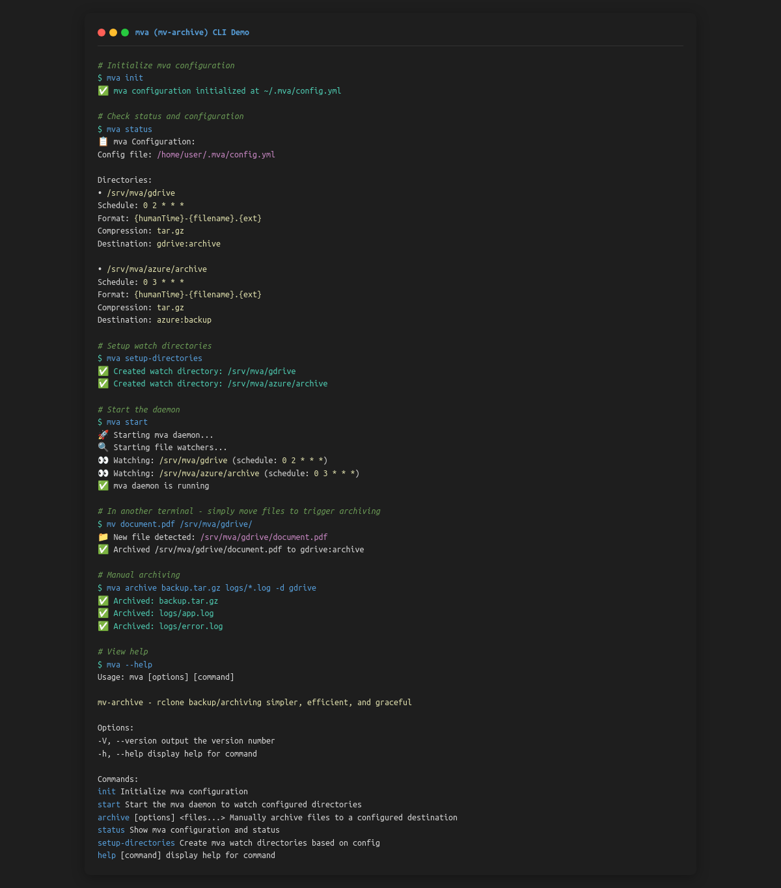

# mva (mv-archive)

> rclone backup/archiving simpler, efficient, and graceful



[](https://opensource.org/licenses/MIT)
[](https://nodejs.org/)
[](https://www.npmjs.com/package/mva)

## Overview

**mva** is a CLI tool that makes file archiving and cloud backup as simple as moving files to a directory. It automatically compresses, timestamps, and uploads files to configured rclone destinations using a simple `mv` operation.

## Why mva?

- **Safety**: Files are safely archived with compression and proper naming
- **Bandwidth optimized**: Uses rclone for efficient cloud transfers
- **Cognitive load minimized**: Just `mv` files to trigger archiving

## Installation

```bash
# Clone and install
git clone <repository>
cd mv-archive-dev
npm install
npm run build

# Make globally available (optional)
npm link
```

## Quick Start

1. **Initialize configuration**:
   ```bash
   mva init
   ```

2. **Edit configuration** at `~/.mva/config.yml`:
   ```yaml
   directories:
     - directory: "/srv/mva/gdrive"
       at: "0 2 * * *"  # Daily at 2 AM
       format: "{humanTime}-{filename}.{ext}"
       compress: "tar.gz"
       destination: "gdrive:archive"
   ```

3. **Setup watch directories**:
   ```bash
   mva setup-directories
   ```

4. **Start the daemon**:
   ```bash
   mva start
   ```

5. **Archive files by moving them**:
   ```bash
   mv document.pdf /srv/mva/gdrive/
   mv backup.tar.gz /srv/mva/azure/archive/
   ```

## Commands

### `mva init`
Initialize mva configuration file at `~/.mva/config.yml` with default settings.

### `mva start`
Start the mva daemon to watch configured directories. Files moved to these directories will be automatically archived.

### `mva archive <files...> -d <destination>`
Manually archive files to a specific destination:
```bash
mva archive file1.txt file2.pdf -d gdrive
```

### `mva status`
Show current configuration and status.

### `mva setup-directories`
Create all watch directories defined in the configuration.

## Configuration

The configuration file is located at `~/.mva/config.yml`:

```yaml
directories:
  - directory: "/srv/mva/gdrive"      # Watch directory
    at: "0 2 * * *"                  # Cron schedule
    format: "{humanTime}-{filename}.{ext}"  # Archive filename format
    compress: "tar.gz"               # Compression method
    destination: "gdrive:archive"    # rclone destination

  - directory: "/srv/mva/azure/archive"
    at: "0 3 * * *"
    format: "{humanTime}-{filename}.{ext}"
    compress: "tar.gz"
    destination: "azure:backup"
```

### Configuration Options

- **directory**: Local directory to watch for files
- **at**: Cron schedule for batch processing (also processes files immediately)
- **format**: Filename format for archived files with placeholders:
  - `{humanTime}`: ISO timestamp (e.g., `2025-08-02_14-30-00`)
  - `{filename}`: Original filename without extension
  - `{ext}`: Original file extension
  - `{timestamp}`: Unix timestamp
  - `{date}`: Date in YYYY-MM-DD format
  - `{time}`: Time in HH-MM-SS format
- **compress**: Compression method (`tar.gz` or `none`)
- **destination**: rclone remote and path (e.g., `myremote:path/to/backup`)

## Prerequisites

- **rclone**: Must be installed and configured with your cloud providers
- **Node.js**: Version 16 or higher

### Setting up rclone

```bash
# Install rclone
curl https://rclone.org/install.sh | sudo bash

# Configure your cloud providers
rclone config

# Test connection
rclone lsd myremote:
```

## How It Works

1. **File Detection**: mva watches configured directories for new files
2. **Processing**: When a file is detected:
   - File is copied to a temporary location
   - Compressed (if configured)
   - Renamed according to the format template
   - Uploaded to the rclone destination
   - Original file is removed
3. **Scheduling**: Cron jobs also run at scheduled times to process any remaining files

## Examples

### Basic Usage
```bash
# Start daemon
mva start

# Archive a document (in another terminal)
mv ~/Documents/report.pdf /srv/mva/gdrive/
# → Uploads as "2025-08-02_14-30-00-report.tar.gz" to gdrive:archive
```

### Manual Archiving
```bash
# Archive specific files immediately
mva archive *.log -d gdrive
```

### Multiple Destinations
```yaml
directories:
  - directory: "/srv/mva/daily"
    at: "0 2 * * *"  # Daily
    destination: "gdrive:daily-backup"
    
  - directory: "/srv/mva/weekly"  
    at: "0 3 * * 0"  # Weekly (Sundays)
    destination: "s3:weekly-archive"
```

## Development

```bash
# Install dependencies
npm install

# Run in development mode
npm run dev

# Build for production
npm run build

# Run built version
npm start
```

## Troubleshooting

### rclone Issues
```bash
# Test rclone connection
rclone lsd your-remote:

# Check rclone config
rclone config show
```

### Permission Issues
Ensure the user running mva has:
- Read/write access to watch directories
- Execute permissions for rclone
- Write access to `/tmp` for temporary files

### File Not Archived
- Check that files are completely written before moving
- Verify rclone destination is accessible
- Check mva daemon logs

## License

ISC

## Contributing

We welcome contributions! Please see [CONTRIBUTING.md](CONTRIBUTING.md) for guidelines.

- 🐛 [Report bugs](../../issues/new?template=bug_report.yml)
- ✨ [Request features](../../issues/new?template=feature_request.yml)
- 💬 [Join discussions](../../discussions)
- 📖 [Improve documentation](CONTRIBUTING.md)

## Support

- 📚 [Documentation](README.md)
- 💬 [Discussions](../../discussions)
- 🐛 [Issues](../../issues)
- 🔧 [rclone Documentation](https://rclone.org/docs/)
